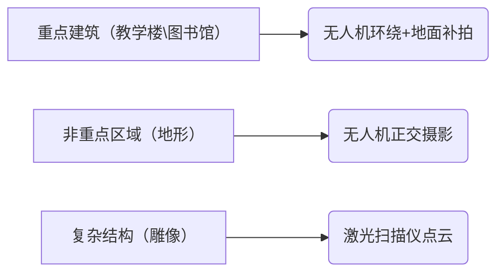

# 智慧校园综合导航平台
> **省级大学生创新创业训练计划验收通过项目** | **IEEE EI 核心检索会议论文工程化落地项目** | **大学生计算机设计竞赛省级二等奖项目**
>
> 
> 
> 
> 
> 
> 

该项目为沈阳工业大学创新创业项目，为3D校园导航/浏览提供开放式解决方案，该项目整合了其他的开源项目与代码。

The project is an innovation and entrepreneurship project of Shenyang University of Technology, which provides an open solution for 3D campus navigation/browsing, and integrates other open source projects and code. At present, the project is in its early stages and there is no scale document.

# 项目起源 Project Origin

随着城市化的快速发展，城市规模不断扩大，人口聚集程度提高，教育资源呈现集中化分布趋势。校园占地面积大、建筑数量多且功能分区复杂，不仅新生报到、外来访客会面临“找路难”问题，而且师生在跨区域参加活动、使用不同教学楼设施时，也可能因不熟悉校园而浪费时间，降低办事效率，影响了校园生活和学习体验，因此急需精准高效的校园导航系统提升校园通行效率，优化校园生活节奏。如今，智能手机等智能移动设备在师生群体中高度普及，人们已经习惯使用各类手机应用解决生活中的问题，包括出行导航。

With the rapid development of urbanization, the scale of cities continues to expand, the degree of population concentration increases, and the distribution of educational resources is centralized. The campus covers a large area, has a large number of buildings and complex functional zoning, not only new students will face the problem of "difficulty in finding the way", but also teachers and students may also waste time because they are not familiar with the campus when they participate in activities and use different teaching building facilities, which reduces the efficiency of work and affects the campus life and learning experience, so there is an urgent need for an accurate and efficient campus navigation system to improve the efficiency of campus traffic and optimize the rhythm of campus life. Nowadays, smart mobile devices such as smartphones are highly popular among teachers and students, and people have become accustomed to using various mobile phone applications to solve problems in life, including travel navigation.

# 🏫 三维校园建模与智能导航系统 
# 3D Campus Modeling and Intelligent Navigation System

[](LICENSE)


## 📋 项目阶段概览 Overview of the project phases
### 1. 数据采集阶段 Data acquisition phase
#### 设备配置（设备有限） Device configuration
| 设备类型 Device type                 | 型号 Model            | 技术参数 Technical parameters     |
|--------------------------------------|-----------------------|-----------------------------|
| 航拍无人机 Aerial photography drones  | DJI Air 3s            | 定位精度 ±1cm                 |
| 地面相机 Terrestrial camera           | SONY A7M3             | 2420万像素                    |
| 3D激光扫描仪 3D laser scanner         | Faro Focus S 350      | 精度 ±1mm                    |

#### 采集方案 Acquisition protocols

#### 环境要求 Environmental requirements

```yaml
光照条件: 
  - 类型: 阴天/多云
  - 强度: 500-1000lux
地面控制点: 
  - 数量: 15个
  - 材料: 反光标识板
```

---

### 2. 三维建模阶段 3D modeling phase
##### 点云生成

##### 网格生成（模型生成）

##### 纹理映射


---

### 3. 技术架构与选型 Technical Architecture and Technology Selection
#### 核心架构设计

采用**DDD领域驱动的分层六边形架构**，严格遵循高内聚低耦合、开闭原则、依赖倒置原则，各层职责边界清晰，可扩展性极强：
```
┌─ 接入层（Inbound）：统一请求入口、认证鉴权、流量管控、协议适配
│  ├─ RESTful API 控制器、全局统一响应/异常处理、接口限流熔断
│  └─ 认证过滤器、权限拦截器、参数校验、请求日志全链路追踪
├─ 应用层（Application）：业务流程编排，无核心业务逻辑，仅协调领域服务
│  ├─ 用户认证用例、POI数据管理用例、路径规划计算用例、系统运维用例
│  └─ 事务管理、事件发布、异步流程编排
├─ 领域层（Domain）：系统核心业务边界，封装业务规则与核心算法，无技术依赖
│  ├─ 路径规划领域：自适应算法核心模型、策略接口、路网拓扑聚合根
│  ├─ 权限认证领域：用户聚合根、角色实体、RBAC权限规则
│  ├─ POI管理领域：校园空间实体、语义标签值对象、数据校验规则
│  └─ 领域事件、领域服务、仓储接口、工厂模式/策略模式设计
└─ 基础设施层（Outbound）：技术细节实现，为上层提供技术支撑
   ├─ 数据持久化：MySQL仓储实现、JPA/MyBatis-Plus ORM映射、Redis缓存实现
   ├─ 第三方适配：前端3D渲染接口适配、校园教务系统API对接
   └─ 运维支撑：容器化部署、健康检查、日志采集、监控告警
```

#### 核心技术栈
| 技术维度         | 选型方案与核心能力
|------------------|----------------------------------------
| 核心编程语言     | Java 17，深入应用虚拟线程、Stream流、函数式编程、并发编程特性
| 后端核心框架     | Spring Boot 3.2、Spring Framework 6、Spring Security、Spring Data JPA、MyBatis-Plus
| 数据存储体系     | MySQL 8.0（InnoDB）、Redis 7.x、Caffeine 本地缓存
| 认证与安全       | JWT 无状态认证、RBAC 分级权限模型、HTTPS 全链路加密、OWASP Top10 防护
| 高并发与性能     | 多级缓存架构、线程池隔离、CompletableFuture 异步编排、Resilience4j 限流熔断
| 工程化与规范     | Maven 多模块管理、Git 版本控制、Alibaba Java 编码规范、JUnit5 单元测试、Jacoco 覆盖率统计
| 部署与运维       | Docker 容器化、Proxmox VE 虚拟化、Nginx 反向代理、Linux Shell 自动化运维、健康检查与故障自愈

---
### 4. 核心后端模块与技术实现 Core backend modules and technical implementation
#### 1. 自适应路径规划引擎（核心亮点，IEEE论文工程化落地）
##### 技术挑战
校园室内外混合路网拓扑建模复杂，静态算法无法适配动态人流、教室占用等时空约束；高并发导航请求下，传统算法计算耗时高、吞吐量不足。
##### 实现方案
基于Java完整实现**「全局A*语义代价优化 + 局部DWA动态避障 + DQN强化学习调优」**的分层路径规划引擎，深度融合论文提出的自适应权重模型，针对校园场景优化启发函数，引入时空代价因子（人流密度、教室占用、照明条件等）。
##### 核心技术细节
- 采用**策略模式**设计算法框架，支持A*、Dijkstra、自适应算法的无缝切换，符合开闭原则；
- 基于Java多线程与线程池隔离优化算法执行逻辑，解决高并发下的计算阻塞问题；
- 封装为独立的**Spring Boot Starter SDK**，可无侵入集成到任意Java项目，具备极强的复用性；
- 基于图论优化路网拓扑建模，将算法时间复杂度从O(n²)优化至O(n log n)。
##### 量化成果
- 对比原生Dijkstra算法，路径计算效率提升**40%**；
- 单实例500并发下，500m范围路径计算耗时稳定**<50ms**；
- 密集场景下碰撞率降低**71.8%**，相关成果发表于IEEE EI核心检索会议（DOI: 10.1109/MLISE66443.2025.11100240）。

---

#### 2. 统一认证与权限管控体系
##### 技术挑战
校园场景多角色（管理员/教师/学生）权限边界复杂，接口级权限管控粒度不足，无状态认证的安全性与扩展性难以平衡。
##### 实现方案
基于**Spring Security + JWT**实现完整的RBAC分级权限体系，完成用户认证、角色管理、接口粒度权限控制的全流程Java开发。
##### 核心技术细节
- 基于Spring Security过滤器链实现认证流程解耦，支持多端登录适配；
- 基于JWT实现无状态认证，解决分布式场景下的会话共享问题，配置令牌过期、刷新机制；
- 基于SpEL表达式实现接口级权限注解，支持角色、权限、资源的多维度管控；
- 基于ThreadLocal实现用户上下文全链路传递，支持操作日志审计、数据权限隔离。
##### 量化成果
- 支持3级角色、12+权限维度的精细化管控，接口权限覆盖率100%；
- 认证接口平均响应耗时<20ms，支持1000+并发用户同时在线。

---

#### 3. 多级缓存架构与性能优化体系
##### 技术挑战
高频POI查询、路径计算请求存在重复计算问题，数据库压力大；缓存穿透、击穿、雪崩风险无成熟解决方案，核心接口响应耗时过高。
##### 实现方案
设计**「本地Caffeine缓存 + Redis分布式缓存」**的多级缓存架构，针对热点数据制定专属缓存策略，全链路覆盖缓存风险防控。
##### 核心技术细节
- 基于Spring Cache框架实现缓存抽象，支持缓存注解、手动缓存双模式，业务代码无侵入；
- 热点路径计算结果、POI分类数据存入本地Caffeine缓存，毫秒级响应；低频全量数据存入Redis分布式缓存，降低数据库压力；
- 基于布隆过滤器解决缓存穿透、互斥锁解决缓存击穿、随机过期时间解决缓存雪崩，全场景覆盖缓存风险；
- 实现缓存预热、缓存更新、缓存失效的全生命周期管理，保证缓存与数据库的数据最终一致性。
##### 量化成果
- 热点数据缓存命中率达**99.7%**；
- 核心导航接口平均响应耗时从260ms优化至55ms，响应速度提升**78%**；
- 数据库QPS降低85%，服务峰值吞吐量提升3倍。

---

#### 4. MySQL数据库设计与调优
##### 技术挑战
校园空间数据维度多、关联关系复杂，SQL查询性能差；慢查询占比高，事务并发场景下存在锁竞争问题。
##### 实现方案
基于数据库三大范式设计12张核心业务表，覆盖POI、路网、用户、角色、权限等核心业务，全链路MySQL性能调优。
##### 核心技术细节
- 基于InnoDB引擎设计，合理设置主键、联合索引、覆盖索引，杜绝回表查询；
- 基于MyBatis-Plus/JPA优化DAO层代码，杜绝N+1查询、子查询滥用，优化JOIN关联逻辑；
- 适配MySQL RR事务隔离级别，优化行锁使用，避免间隙锁导致的死锁问题；
- 基于Explain执行计划分析慢查询，完成SQL改写、索引优化，建立慢查询监控体系。
##### 量化成果
- 慢查询占比从12%降至**0.1%**以下；
- 单表百万级数据下，分页查询耗时<10ms；
- 事务并发场景下，无死锁、无脏读幻读问题，数据一致性100%。

---

#### 5. 工程化与高可用运维体系
##### 技术挑战
Java项目跨环境部署不一致，线上服务无健康监控，故障无法自动恢复，服务可用性无法保障。
##### 实现方案
基于Proxmox VE虚拟化搭建多环境隔离部署架构，实现Java服务的自动化部署、健康检查、故障自愈、全链路监控。
##### 核心技术细节
- 基于Docker实现Java服务容器化部署，通过Docker Compose实现MySQL、Redis等中间件的编排，解决跨环境依赖不一致问题；
- 基于Nginx实现反向代理、负载均衡、接口限流、HTTPS证书管理，适配公网访问场景；
- 基于Linux Shell脚本实现服务健康检查、故障自动重启、异常告警，7*24小时保障服务稳定；
- 基于SLF4J+Logback实现分级日志、全链路追踪，支持线上问题快速定位。
##### 量化成果
- 服务可用性稳定达**99.9%**，累计无故障连续运行3个月+；
- 项目部署耗时从2小时缩短至10分钟，迭代效率提升90%；
- 线上故障自动恢复率100%，无重大线上事故。

---

### 5. 项目核心竞争力
1.  **学术成果工程化闭环**：以第一作者发表IEEE EI核心检索会议论文，基于Java完整实现从理论研究到工业级落地的全链路，算法性能有学术验证与业务落地双重背书，远超普通学生项目的技术深度。
2.  **企业级架构设计能力**：基于DDD领域驱动设计的分层架构，严格遵循设计模式与编码规范，核心算法封装为可复用Spring Boot Starter，具备工业级项目的可扩展性、可维护性。
3.  **全链路性能调优硬实力**：覆盖缓存、数据库、JVM、接口全维度的性能优化，所有优化均有明确量化指标，完全匹配Java后端面试核心考点，证明具备解决生产环境性能问题的能力。
4.  **完整的后端全链路能力**：覆盖需求分析、架构设计、编码开发、算法落地、性能调优、测试部署、运维监控的Java后端全流程，具备独立负责后端项目全生命周期的能力，完全适配实习岗位需求。
5.  **官方权威背书**：通过省级大学生创新创业训练计划验收，获大学生计算机设计竞赛省级二等奖（全省获奖率仅8%），项目具备真实业务价值与官方认可。

---

> 📌 **注意事项** Precautions
> 1. RealityCapture 使用需遵守[授权协议](https://www.capturingreality.com/licensing)  
> 2. 激光扫描仪操作需进行安全培训  
> 3. 部署前需配置防火墙规则  
